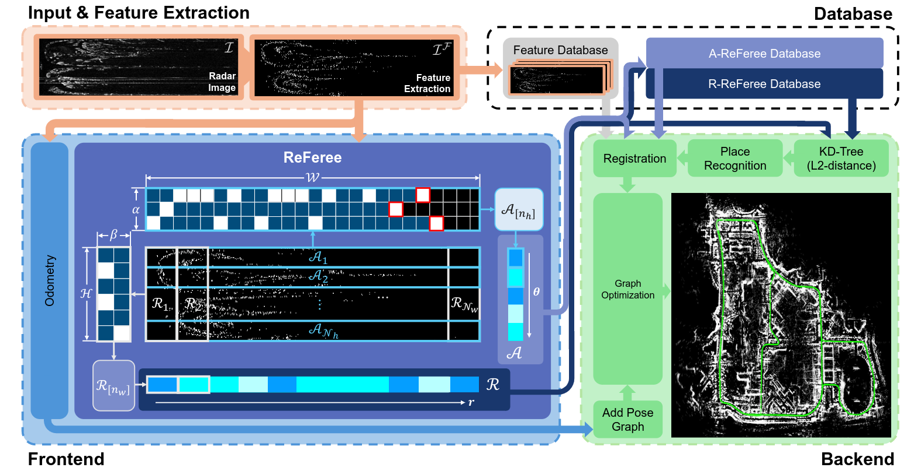

<div align="center">
  <h1>ReFeree</h1>
  <a href="/"></a>
  <a href=""></a>
  <a href="https://sites.google.com/view/referee-radar"></a>
  <a href="https://ieeexplore.ieee.org/document/10705066"></a>
  <a href="https://arxiv.org/abs/2410.01325"></a>
  <a href="https://www.alphaxiv.org/abs/2410.01325"></a>
  <a href="https://www.youtube.com/watch?v=aQ0OlHYJCYI"></a>
  <br />
  <br />

**[IEEE RA-L]** This repository is the official code for **ReFeree**: Radar-Based Lightweight and Robust Localization Using Feature and Free space.

  <a href="https://scholar.google.com/citations?user=t5UEbooAAAAJ&hl=ko" target="_blank">Hogyun Kim*</a><sup></sup>,
  <a href="https://scholar.google.com/citations?user=JCJAwgIAAAAJ&hl=ko" target="_blank">Byunghee Choi*</a><sup></sup>,
  <a href="https://scholar.google.co.kr/citations?view_op=list_works&hl=ko&user=rcp7sWAAAAAJ" target="_blank">Euncheol Choi</a><sup></sup>,
  <a href="https://scholar.google.com/citations?user=W5MOKWIAAAAJ&hl=ko" target="_blank">Younggun Cho</a><sup>†</sup>

(* represents equal contribution.)

**[Spatial AI and Robotics Lab (SPARO)](https://sites.google.com/view/sparo/%ED%99%88?authuser=0&pli=1)**

</div>

## News
* [September, 2024] Now, Cpp version's ReFeree code is released!!
* [September, 2024] Now, [ReFeree-Radar-SLAM](https://github.com/sparolab/referee_radar_slam.git) is released!!
* [September, 2024] Now, Python version's ReFeree code is released!!
* [September, 2024] ReFeree is accepted in RA-L!!

## Note
* ReFeree can be integrated with various Radar odometry.
	* Integrated with Yeti-Odometry: [ReFeree-Radar-SLAM](https://github.com/sparolab/referee_radar_slam.git)

## What is the ReFeree?
* ReFeree is a radar-based lightweight and robust global descriptor utilizing features and free space.
* ReFeree achieves rotational invariance and lightweight by selecting a one-dimensional ring-shaped description and robustness by mitigating the impact of false detection utilizing opposite noise characteristics between free space and feature.
  <p align="center"></p>


## How to use the ReFeree?
* Python version
    ```
    $ git clone https://github.com/sparolab/referee.git
    $ cd python
    $ python3 test.py
    ```

* Cpp version
	```
	$ git clone https://github.com/sparolab/referee.git
	$ cd cpp
	$ mkdir build
	$ cd build
	$ cmake ..
	$ make
	$ ./test_referee
	```

## Supplementary
* [Arxiv](https://arxiv.org/abs/2410.01325)
* [Paper]()
* [Video](https://www.youtube.com/watch?v=aQ0OlHYJCYI)
* [Project page](https://sites.google.com/view/referee-radar)


## Main Contribution
* [Hogyun Kim](https://scholar.google.com/citations?user=t5UEbooAAAAJ&hl=ko)
* [Byunghee Choi](https://scholar.google.com/citations?user=JCJAwgIAAAAJ&hl=ko)
* [Euncheol Choi](https://scholar.google.co.kr/citations?view_op=list_works&hl=ko&user=rcp7sWAAAAAJ)
* [Younggun Cho](https://scholar.google.com/citations?user=W5MOKWIAAAAJ&hl=ko)

## Special Thanks
* [SARAH H. CEN](https://scholar.google.com/citations?user=2BTuWpgAAAAJ&hl=en)
* [Keenan Burnett](https://github.com/keenan-burnett/radar_to_lidar_calib)

## Citation
```
@article{kim2024referee,
  title={ReFeree: Radar-Based Lightweight and Robust Localization using Feature and Free space},
  author={Kim, Hogyun and Choi, Byunghee and Choi, Euncheol and Cho, Younggun},
  journal={IEEE Robotics and Automation Letters},
  year={2024},
  publisher={IEEE}
}
```

## Contact
* Hogyun Kim (hg.kim@inha.edu)
* Byunghee Choi (bhbhchoi@inha.edu)

## License
* For academic usage, the code is released under the BSD 3.0 license. For any commercial purpose, please contact the authors.

