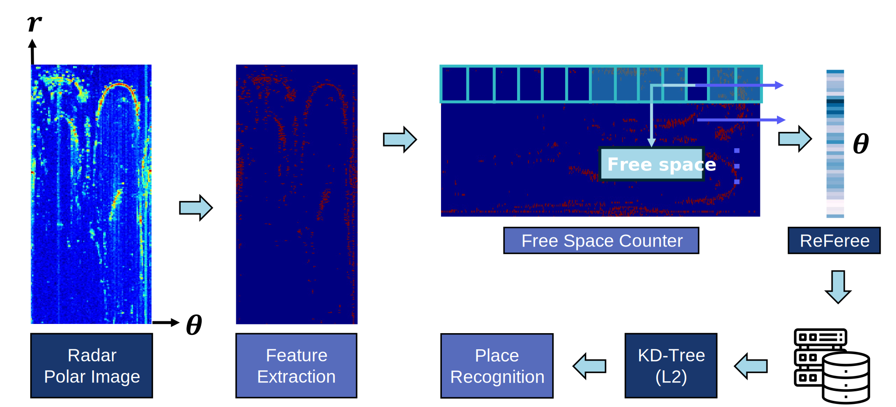
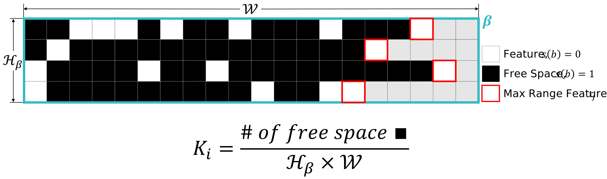

# ReFeree: Radar-based efficient global descriptor using a Feature and Free space for Place Recognition

**ICRA Workshop 2024 (Radar in Robotics)**

This repository represents the official implementation of the paper titled "ReFeree: Radar-based efficient global descriptor using a Feature and Free space for Place Recognition".

[Byunghee Choi*](https://scholar.google.co.kr/citations?view_op=list_works&hl=ko&user=JCJAwgIAAAAJ),
[Hogyun Kim*](https://scholar.google.co.kr/citations?user=t5UEbooAAAAJ&hl=ko),
[Younggun Cho](https://scholar.google.com/citations?user=W5MOKWIAAAAJ&hl=ko)
(* represents equal contribution.)

## News!
We will submit the journal version preprint to the community, soon.

## Pipeline

## Generation

## How to use Referee?
**0. Download Datasets and Modify datasets_name in "place_description.py"**
<pre>
<code>
    $ parser.add_argument('--datasets_name', type = str, default = 'your_datasets_name', help = 'we propose various methods (referee)')
</code>
</pre>  

**1. Create the Referee** 
  * We implement our place recognition method in python3. 
<pre>
<code>
    $ python3 place_description.py
</code>
</pre>  

**2. Enjoy place recognition with Referee (cf. we provide the single/multi-session mode)** 
  * We implement our place recognition method in python3. 
<pre>
<code>
    $ python3 place_recognition.py
</code>
</pre>  

## Contact
* Byunghee Choi (bhbhchoi@inha.edu)
* Hogyun Kim (hg.kim@inha.edu)
